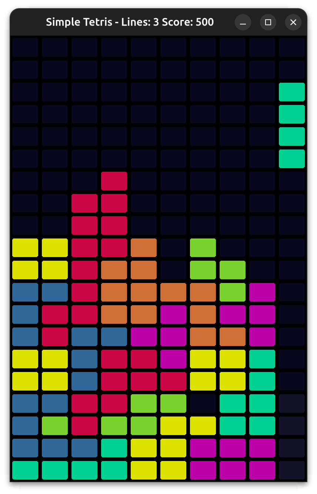

# arcade-tetris

An implementation of Tetris using Python's wonderful Arcade library

this project was originally written using version `2.6.17` of the `arcade` package.
I recently upgraded it to use verison `3.0`, to play this you will need to install that.
